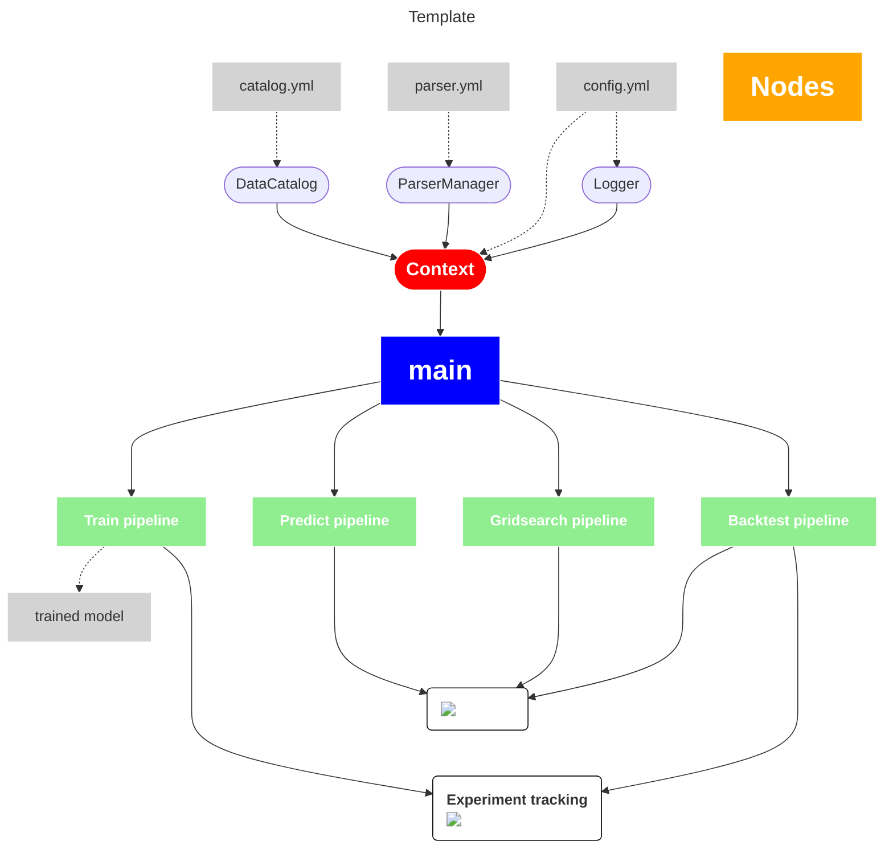

!!! warning
    This is post is really boring but fucking useful


As Data Scientist my job conist at the end to formalize a problem that was told be about (or something that I found useful to solve), translate it in a mathematical framework and then use a programming language to solve it numerically.

The most interesting part is of course to create the core mathematical model, i.e. the part of the process in which I am asked to produce something original (or draw on my background and knoweldge to produce a solution).

The reality is that whatever I produce as mathematical model at the end must be translated in a program that usually must run periodically and business more and more rely on its output and on the fact that it will always work

<br>


<br>
<br>

I am not a SE and my heart belongs to math but in my small experience I've realised pretty soon how much time the step **Programming solution** can take both when you write the program the first time and in particular to mantain and expand the application itself.


Since I am really lazy and I really wanted to minimize the time spent of these boring step I end up creating a cookiecutter template for my programs (mostly timeseries forecasting but the template is pretty general).

The purpose of such template is pretty obvious:
* Less code to write (**less repetitive job**)
* Every program will looks like the same so that I will never be lost.


!!! info   
    The template is tailor made to work with modules I wrote to make my programs more clean and clear.

    You can find these modules in the git repository:

    https://github.com/clarkmaio/clarkpy_essentials

    99% of the philosophy behind this template is still valid and can be adopted in any case.


## Structure
Let's see the structure first and few comments on the core parts of this template

```
MyProgram/
├── conf/
│   ├── catalog.yml
│   ├── config.yml
│   └── parser.yml
├── dataset
├── log
├── notebooks
├── src/
│   ├── __main__.py
│   ├── data_loader
│   ├── data_transformer
│   ├── model
│   ├── nodes
│   └── pipeline/
│       ├── backtest.py
│       ├── gridsearch.py
│       ├── predict.py
│       └── train.py
├── submodules
├── .gitignore
├── README.md
└── requirements.txt
```


## But... why?
Now I will explain each part of this template and what is the purpose of the main modules.


### main
The entry point for every functionality of the program is `__main__.py`. <br>
**It is the only script you are sopposed to launch.**

```shell
cd MyProgram
python src/__main__.py --key1 arg1 --key2 arg2 ...
```

Two things will happen in the main function:
* Initialisation of context (see below)
* Run pipeline depending of user request

### conf
In `conf` folder are stored all the settings file:
* `config.yml`: global variables. Those variables that are supposed to never change.
* `parser.yml`: variables that user must initialize via argument parser. 
                
    These keys namely determine whih pipeline will run and variables that user need to change easily.

* `catalog.yml`: this file is ment to be used with `DataCatalog` class of `clarkpy_essentials` but it can be useful even if you are not using this tool.

    In this file are stored path to dataset, instructions about how these dataset should be loaded and sql queries.

    Each dataset is mapped to a label so that it will be extremely easy and clean to load the datasets when using `Pipeline` syntax.


### src
This is the folder where you will find core functions.

My idea consist simply in writing a pipeline function (eventually using the `Pipeline` class) in `pipeline` folder for every functionality of the program.

The rest of the code base is a support for these functions.

* `data_loader`: functions to collect/merge data and eventually loading them in case you are not using `DataCatalog`.
* `data_transform`: collection of functions to transform data. Also this part can be simplified a lot using `DataTransformer` from `clarkpy_essentials`. 
    
    See the github page of the repository for examples.

* `model`: simple class to store model class and relative configuration files.

    I usually have one `yml` file for each model.

* `nodes`: this is the folder where I store atomic functions that are building blocks of my pipelines.

    At the end pipelines will be nothing but a sequantial script that call a set of nodes.

